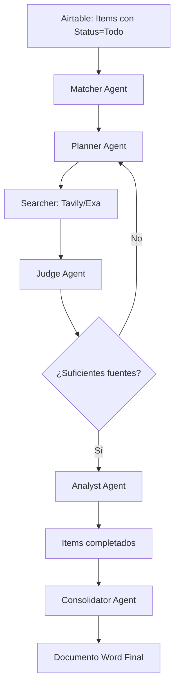

# LetsInnovate: Deep Research Platform


**Sistema de investigación autónoma basado en agentes de IA para la generación de informes empresariales ultra-personalizados**

---

## 🎯 ¿Qué hace esta herramienta tan potente?

El **Deep Research Agent** no es simplemente un generador de documentos. Es una **plataforma de inteligencia estratégica** que combina el poder de múltiples modelos de IA (GPT-4, Gemini 2.5 Pro, Claude) con búsqueda especializada en la web profunda para crear informes de investigación completamente personalizados.

### El Secreto: **Título + Índice + Agente = Informe Perfecto**

La verdadera potencia de esta herramienta reside en cómo **orientas** tus investigaciones:

1. **El Título del Item** → Define el enfoque y perspectiva del capítulo
2. **El Índice del Proyecto** → Estructura la narrativa y determina qué aspectos profundizar
3. **El Agente (System Prompt)** → Personaliza el tono, profundidad técnica y estilo

**Ejemplo práctico:**

Imagina que quieres investigar "IA en el sector salud". Dependiendo de cómo lo orientes:

| Título Item | Índice Proyecto | Agente | Resultado |
|-------------|-----------------|--------|-----------|
| "Implementación de IA en hospitales" | - Casos de uso<br>- ROI<br>- Regulaciones | Consultor Estratégico | Informe ejecutivo con enfoque en adopción empresarial |
| "Algoritmos de diagnóstico por IA" | - Arquitecturas ML<br>- Datasets<br>- Métricas | Investigador Técnico | Análisis profundo de modelos y rendimiento |
| "Impacto de IA en pacientes" | - Experiencia usuario<br>- Ética<br>- Privacidad | Analista Social | Perspectiva humanística y social |

**El mismo tema, tres documentos completamente diferentes.** Esta es la versatilidad que ofrece el sistema.

---

## 📚 Tabla de Contenidos

1. [Arquitectura del Sistema](#️-arquitectura-del-sistema)
2. [Proceso de Generación de Documentos](#-proceso-de-generación-de-documentos-paso-a-paso)
3. [Configuración Avanzada](#️-configuración-avanzada-configtoml)
4. [Gestión mediante Airtable](#-gestión-mediante-airtable)
5. [Instalación](#-instalación-y-preparación)
6. [Guía de Uso](#-guía-de-uso)
7. [Despliegue en Render.com](#-despliegue-en-rendercom)

---

## 🏗️ Arquitectura del Sistema

El sistema opera mediante **6 agentes especializados** que colaboran en un flujo orquestado:



### Los 6 Agentes y sus Funciones

| Agente | Rol | Modelo | Variables configurables en `config.toml` |
|--------|-----|--------|------------------------------------------|
| **🎯 Matcher** | Analiza el tema y asigna el perfil de experto (System Prompt) más adecuado | `xiaomi/mimo-v2-flash` | `[roles.matcher]` → provider, model, temperature |
| **📋 Planner** | Genera estrategias de búsqueda y queries optimizadas | `xiaomi/mimo-v2-flash` | `[roles.planner]` + `[search]` → max_search_queries |
| **🔍 Searcher** | Ejecuta búsquedas en la web profunda (Tavily/Exa) | - | `[search]` → tavily_search_depth, max_results_per_query, excluded_domains |
| **⚖️ Judge** | Evalúa calidad de fuentes (relevancia, autoridad, actualidad) | `xiaomi/mimo-v2-flash` | `[roles.judge]` + `[evaluator]` → thresholds, min_accepted_sources |
| **✍️ Analyst** | Sintetiza información y redacta capítulos individuales | `claude-haiku-4.5` | `[roles.analyst]` + `[general]` → target_audience, report_language |
| **📖 Consolidator** | Integra todos los capítulos en un documento coherent con índice y referencias | `gemini-2.5-pro` | `[roles.consolidator]` + `[references]` → style, enable_hyperlinks |

---

## 🔄 Proceso de Generación de Documentos: Paso a Paso

### **Fase 1: Definición del Proyecto en Airtable**

**¿Qué haces?**
1. Creas un registro en la tabla **Proyectos**
2. Defines el **Nombre** del proyecto
3. Añades **Items** (capítulos/temas) relacionados en **Items_indice**
4. Opcionalmente, adjuntas **documentos de contexto** interno (PDFs, DOCX) en el campo `Context`

**Variables relevantes:**
```toml
[context]
source = "airtable"  # Si quieres que descargue docs desde Airtable
# o
source = "local"     # Si prefieres usar carpeta private_context/

[airtable]
proyectos_table_name = "Proyectos"
items_table_name = "Items_indice"
```

**Estado del Proyecto:**
- `Submitted` → Proyecto en cola (no se procesa automáticamente)
- `Todo` → Listo para procesarse
- `Generating items` → Procesando items
- `Processing` → Consolidando documento final
- `Done` → Completado

---

### **Fase 2: Asignación Inteligente de Agentes (Matcher)**

**¿Qué hace el sistema?**
- Lee cada item con `Status='Todo'`
- Analiza el **título** y **descripción** del tema
- Compara con todos los **System Prompts** disponibles
- Selecciona el perfil de experto más adecuado automáticamente
- Actualiza `System_Prompt_Link` y cambia `Status` a `Pending`

**Comando:** `python main.py match` (o automático con `pipeline`)

**Variables relevantes:**
```toml
[roles.matcher]
provider = "openrouter"
model = "xiaomi/mimo-v2-flash:free"
temperature = 0.0  # 0.0 = determinista, 1.0 = creativo

[airtable]
prompts_table_name = "System_Prompts"
```

**Ejemplo de System Prompts:**
- "Consultor Estratégico Tecnológico" → IA, Digital Transformation, Innovation
- "Analista Financiero Senior" → M&A, Valuations, Market Analysis
- "Investigador Académico" → Deep technical research, citations, rigor

---

### **Fase 3: Investigación Profunda (Planner + Searcher + Judge)**

Esta es la **fase más crítica** donde se decide la calidad del informe final.

#### **3.1. Planner: Generación de Estrategias de Búsqueda**

**¿Qué hace?**
- Recibe el **tema**, **contexto general de la empresa** y **temas relacionados** (todo el índice del proyecto)
- Genera múltiples queries de búsqueda optimizadas
- Considera sinónimos, términos técnicos, perspectivas alternativas

**Variables relevantes:**
```toml
[search]
max_search_queries = 3  # Cuántas búsquedas diferentes genera

[general]
target_audience = "CEO/Directivos"  # Influencia el tipo de fuentes a buscar
```

**Ejemplo:**
- Tema: "IA en diagnóstico médico"
- Queries generadas:
  1. "AI medical diagnosis algorithms FDA approved 2024"
  2. "deep learning radiology image analysis clinical validation"
  3. "artificial intelligence diagnostic accuracy vs human doctors"

#### **3.2. Searcher: Ejecución de Búsquedas**

**¿Qué hace?**
- Ejecuta búsquedas en **Tavily** y **Exa** (motores especializados en investigación)
- Extrae contenido de páginas web (hasta 4000 caracteres por fuente)
- Filtra dominios excluidos automáticamente

**Variables relevantes:**
```toml
[tools]
tavily_enabled = true
exa_enabled = true

[search]
max_results_per_query = 5  # Resultados por búsqueda
max_chars_per_source = 4000  # Texto extraído por fuente
tavily_search_depth = "advanced"  # "basic" (rápido) vs "advanced" (exhaustivo)

excluded_domains = [
    "quora.com",
    "reddit.com",
    "wikipedia.org",
    # ... más dominios de baja calidad
]
```

**💡 Tip:** Aumenta `max_results_per_query` a 10 para temas muy específicos

#### **3.3. Judge: Evaluación de Calidad**

**¿Qué hace?**
- Evalúa **cada fuente** encontrada según 4 criterios:
  1. **Relevancia** (0-10): ¿Responde directamente al tema?
  2. **Autoridad** (0-10): ¿Es la fuente confiable y experta?
  3. **Actualidad** (0-10): ¿Es información reciente?
  4. **Profundidad** (0-10): ¿Ofrece análisis detallado?

- Calcula puntuación total (promedio de los 4)
- **Acepta** si supera los umbrales configurados
- **Rechaza** si no cumple los criterios

**Variables relevantes:**
```toml
[evaluator]
total_score_threshold = 8  # Puntuación mínima promedio (0-10)
relevance_score_threshold = 8  # Relevancia mínima específica
min_accepted_sources = -1  # Mínimo de fuentes aceptadas (-1 = sin límite)

[general]
max_retries = 3  # Reintentos si no hay suficientes fuentes
```

**Feedback Loop:**
Si no se alcanzan suficientes fuentes de calidad → vuelve al **Planner** → genera nuevas queries → repite hasta `max_retries`

---

### **Fase 4: Síntesis y Redacción (Analyst)**

**¿Qué hace?**
- Recibe **todas las fuentes aceptadas**
- Lee el **System Prompt** asignado (perfil de experto)
- Considera el **contexto de la empresa** y **temas relacionados** (todo el índice)
- Redacta un capítulo completo y detallado
- Genera automáticamente **gráficos** si `enable_plots = true`
- Incluye **citas IEEE** con números `[1], [2]...`

**Variables relevantes:**
```toml
[roles.analyst]
provider = "openrouter"
model = "anthropic/claude-haiku-4.5"  # Modelo con gran ventana de contexto
temperature = 0.0  # 0.0 = factual y riguroso

[general]
target_audience = "CEO/Directivos"  # Adapta vocabulario y profundidad
report_language = "English"  # Idioma de redacción
enable_plots = true  # Genera gráficos automáticos

[context]
source = "local"  # Usa contexto de private_context/ o Airtable
```

**Estructura del capítulo generado:**
```markdown
# [Título del Item]

[Párrafo introductorio rico en contexto]

## 1. Primera Sección
[Contenido detallado con datos, ejemplos, análisis]

### 1.1. Subsección
[Profundización técnica]

## 2. Segunda Sección
...

## References
[1] Author, "Title", URL
[2] ...
```

**💡 Tip:** Cambia `temperature` a 0.3-0.5 si quieres un estilo más narrativo y menos técnico

---

### **Fase 5: Consolidación Final (Consolidator)**

**¿Qué hace?**
- Espera a que **todos los items** del proyecto estén `Status='Done'`
- Recopila **todos los capítulos** generados
- Lee la **estructura propuesta** del índice (todos los títulos de items)
- Genera:
  - **Título principal** del documento
  - **Tabla de contenidos** dinámica
  - **Executive Summary** (resumen ejecutivo)
  - **Introducción** contextualizada
  - **Conclusiones** integradoras
  - **Referencias consolidadas** en formato IEEE

- Crea el documento **Word (.docx)** con formato profesional
- Sube a **Cloudflare R2** (si está habilitado)
- Vincula el archivo en **Airtable**

**Variables relevantes:**
```toml
[roles.consolidator]
provider = "openrouter"
model = "google/gemini-2.5-pro"  # Ventana de contexto masiva (2M tokens)
temperature = 0.0

[general]
upload_to_r2 = true  # Sube a R2 y vincula en Airtable
target_audience = "CEO/Directivos"
report_language = "English"

[references]
enable_hyperlinks = true  # Citas [1] clicables
style = "IEEE"  # Estilo de referencias

[references.link_style]
font = "Calibri"
size_pt = 10
blue = true
underline = true
```

**Formato Word generado:**
- **Template base:** `assets/template.docx` (estilos profesionales predefinidos)
- **Jerarquía de headers:** H1 → H2 → H3 → H4
- **Table of Contents** interactiva
- **Imágenes** (plots) embebidas
- **Referencias clicables** (si enable_hyperlinks = true)

---

## ⚙️ Configuración Avanzada: `config.toml`

El archivo `config.toml` es el **centro de control** de todo el sistema. Permite personalizar cada aspecto sin tocar código.

### 1. **Configuración General `[general]`**

```toml
[general]
use_deepseek_for_testing = false  # true = usa DeepSeek (más barato) para todo
target_audience = "CEO/Directivos"  # Adapta tono y profundidad
report_language = "English"  # Idioma del documento
max_retries = 3  # Reintentos si no hay suficientes fuentes
concurrency_limit = 1  # Items procesados simultáneamente
```

**¿Cuándo modificar?**
- `target_audience`: Cambia según quién vaya a leer el documento
  - "CEO/Directivos" → Visión estratégica, ROI, impacto de negocio
  - "Equipo Técnico" → Detalles de implementación, arquitectura, código
  - "Analistas Financieros" → Métricas, valoraciones, proyecciones
  
- `concurrency_limit`: Aumenta a 2-3 si tienes buen hardware y muchos items

---

### 2. **Contexto del Proyecto `[context]`**

```toml
[context]
source = "local"  # "local" o "airtable"
local_folder = "private_context"
```

**Modos disponibles:**

#### **Modo Local (Recomendado para producción)**
- Coloca archivos `.txt` o `.md` en `private_context/`
- Carga instantánea, sin descargas de Airtable
- Ideal para **Render.com** (evita problemas de memoria)

**Ejemplo:**
```bash
private_context/
├── company_strategy_2026.md
├── product_portfolio.txt
└── market_positioning.md
```

#### **Modo Airtable (Para desarrollo)**
- Descarga adjuntos del campo `Context` en tabla Proyectos
- Procesa PDFs/DOCX con **Docling** (pesado, puede fallar en Render free tier)

**¿Cuándo usar cada uno?**
- `local`: Despliegue en Render, contexto fijo, máxima velocidad
- `airtable`: Desarrollo local, contexto cambia frecuentemente

---

### 3. **Roles de LLM `[roles.*]`**

Cada agente puede usar un modelo diferente. Ejemplos:

```toml
[roles.planner]
provider = "openrouter"  # "openai", "gemini", "deepseek", "openrouter"
model = "xiaomi/mimo-v2-flash:free"
temperature = 0.0

[roles.analyst]
provider = "openrouter"
model = "anthropic/claude-haiku-4.5"  # Modelo con 200K tokens de contexto
temperature = 0.0
```

**Modelos recomendados por tarea:**
- **Planner/Judge**: Modelos rápidos y baratos (`xiaomi/mimo`, `gpt-4o-mini`)
- **Analyst**: Modelos con gran contexto (`claude-haiku`, `gemini-1.5-pro`)
- **Consolidator**: Modelos con contexto masivo (`gemini-2.5-pro` = 2M tokens)

**💡 Optimización de costes:**
```toml
[general]
use_deepseek_for_testing = true  # Usa DeepSeek para todo (testing)
```

---

### 4. **Búsqueda y Evaluación**

```toml
[search]
max_search_queries = 3  # Número de búsquedas por tema
max_results_per_query = 5  # Resultados analizados por búsqueda
max_chars_per_source = 4000  # Texto extraído por fuente
tavily_search_depth = "advanced"  # "basic" (rápido) o "advanced" (exhaustivo)

excluded_domains = [
    "quora.com",
    "reddit.com",
    # Añade más si necesitas
]

[evaluator]
total_score_threshold = 8  # Puntuación mínima (0-10)
relevance_score_threshold = 8  # Relevancia específica
min_accepted_sources = -1  # Mínimo de fuentes (-1 = sin límite)
```

**Escenarios de configuración:**

| Escenario | max_search_queries | max_results_per_query | tavily_search_depth | min_accepted_sources |
|-----------|-------------------|---------------------|---------------------|---------------------|
| **Investigación profunda** | 5 | 10 | advanced | 8 |
| **Informe rápido** | 2 | 3 | basic | 3 |
| **Tema muy específico** | 3 | 10 | advanced | -1 |
| **Overview general** | 2 | 5 | basic | 5 |

---

### 5. **Referencias y Formato**
Actualemente solo está activada la opción de IEEE. WiP...
```toml
[references]
enable_hyperlinks = true  # Citas [1] clicables
style = "IEEE"  # "IEEE", "APA", "MLA", etc.
```

**Estilos de referencia soportados:**
- **IEEE**: `[1] Author, "Title", Source, Year.`
- **APA**: `(Author, Year)`
- **MLA**: `Author. "Title." Source Year.`

---

## 💾 Gestión mediante Airtable

### **Tabla: Proyectos**

| Campo | Tipo | Descripción |
|-------|------|-------------|
| **Name** | Text | Nombre del proyecto |
| **Status** | Single Select | `Submitted` → `Todo` → `Generating items` → `Processing` → `Done` |
| **Items_Relacionados** | Link to Items_indice | Items que componen el proyecto |
| **Context** | Attachment | Documentos internos (solo si `context.source = "airtable"`) |
| **Consolidated_Report** | URL | Enlace al documento Word final (si `upload_to_r2 = true`) |
| **Attachment** | Attachment | Archivo Word subido automáticamente |

**Estados del proyecto:**
- `Submitted`: En cola, **NO se procesa** (control manual)
- `Todo`: Listo para generar items
- `Generating items`: Procesando investigación
- `Processing`: Consolidando documento
- `Done`: Completado ✅

---

### **Tabla: Items_indice**

| Campo | Tipo | Descripción |
|-------|------|-------------|
| **Topic** | Text | Título del capítulo/tema |
| **Status** | Single Select | `Submitted` → `Todo` → `Pending` → `Processing` → `Done` |
| **System_Prompt_Link** | Link to System_Prompts | Agente asignado |
| **Proyectos_NEW** | Link to Proyectos | Proyecto al que pertenece |
| **Final_Report** | Long Text | Capítulo generado (Markdown) |
| **Fuentes_Acumuladas** | Long Text | Fuentes encontradas y evaluadas |
| **Sources_Count** | Number | Número de fuentes aceptadas |

**Flujo de estados:**
```
Todo → (Matcher asigna agente) → Pending → (Manager inicia investigación) → Processing → Done
```

**💡 Control por proyecto:**
Si el proyecto padre tiene `Status='Submitted'`, los items **NO se procesan** aunque estén en `Todo`.

---

### **Tabla: System_Prompts**

Define los **perfiles de experto** que guían la investigación.

| Campo | Tipo | Contenido |
|-------|------|-----------|
| **Name** | Text | "Consultor Estratégico", "Analista Financiero", etc. |
| **System_Prompt** | Long Text | Instrucciones para el agente (tono, enfoque, profundidad) |
| **Description** | Long Text | Cuándo usar este perfil |

**Ejemplo de System Prompt:**
```
Eres un Consultor Estratégico Senior especializado en transformación digital.

Tu objetivo es analizar el tema desde una perspectiva de negocio:
- Enfócate en ROI, casos de uso empresariales y adopción
- Incluye métricas de mercado y tendencias
- Evita detalles técnicos profundos
- Lenguaje claro para directivos C-level
```

---

## 🛠 Instalación y Preparación

### **Requisitos**
- Python 3.10.19
- Conda (recomendado) o virtualenv

### **Instalación con Conda**

```bash
# 1. Crear entorno
conda create -n deep_research python=3.10.19 -y
conda activate deep_research

# 2. Instalar dependencias
pip install -r requirements.txt

# 3. Configurar variables de entorno
cp .env.example .env
# Editar .env con tus API keys
```

### **Variables de entorno (.env)**

```env
# APIs de LLM
OPENAI_API_KEY=sk-...
GOOGLE_API_KEY=...
DEEPSEEK_API_KEY=...
OPENROUTER_API_KEY=sk-or-...

# APIs de búsqueda
TAVILY_API_KEY=tvly-...
EXA_API_KEY=...

# Airtable
AIRTABLE_API_KEY=pat...
AIRTABLE_BASE_ID=app...

# Cloudflare R2 (Opcional)
R2_ACCESS_KEY_ID=...
R2_SECRET_ACCESS_KEY=...
R2_ENDPOINT_URL=https://...
R2_BUCKET_NAME=...
R2_PUBLIC_DOMAIN=https://...
```

---

## 🚀 Guía de Uso

### **Modos de Ejecución**

#### **1. Pipeline Completo (Recomendado)**
```bash
python main.py pipeline
```

Ejecuta:
1. Asignación de agentes (`match`)
2. Investigación de items (`items`)
3. Consolidación de proyectos completados (`proyectos`)

**¿Cuándo usar?** Flujo automático de principio a fin.

---

#### **2. Asignación de Agentes**
```bash
python main.py match
```

- Busca items con `Status='Todo'`
- Asigna el System Prompt más adecuado
- Cambia a `Status='Pending'`

**¿Cuándo usar?** Solo quieres asignar agentes sin procesar.

---

#### **3. Procesamiento de Items**
```bash
python main.py items
```

- Procesa items con `Status='Pending'`
- Ejecuta búsqueda → evaluación → síntesis
- Marca como `Done`

**¿Cuándo usar?** Ya tienes agentes asignados manualmente.

---

#### **4. Consolidación de Proyectos**
```bash
python main.py proyectos
```

- Busca proyectos con `Status='Generating items'` y todos sus items `Done`
- Consolida capítulos en documento Word
- Sube a R2 (si habilitado)

**¿Cuándo usar?** Quieres forzar consolidación de proyectos listos.

---

#### **5. Modo Servidor (Webhooks)**
```bash
python main.py server
```

Inicia servidor FastAPI en puerto 8000 (o `$PORT`).

**Endpoints:**
- `POST /webhook/process-item` → Procesa item específico
- `POST /webhook/pipeline` → Ejecuta pipeline completo

**¿Cuándo usar?** Despliegue en Render.com con webhooks de Airtable.

---

## 🌐 Despliegue en Render.com

### **Preparación**

1. **Configurar contexto local:**
```toml
[context]
source = "local"  # Evita Docling (pesado para Render free tier)
local_folder = "private_context"
```

2. **Añadir documentos de contexto:**
```bash
# Convertir tus PDFs a texto
pandoc company_info.pdf -o private_context/company_info.txt
```

3. **Configurar archivo `Procfile`:**
```
web: python main.py server
```

### **Variables de entorno en Render**

En el dashboard de Render, añade todas las keys del `.env`:
- `OPENAI_API_KEY`
- `GOOGLE_API_KEY`
- `AIRTABLE_API_KEY`
- `AIRTABLE_BASE_ID`
- `TAVILY_API_KEY`
- `R2_*` (si usas R2)

### **Webhook de Airtable**

En Airtable Automations:

```javascript
// Trigger: When Status changes to 'Todo'
// Action: Send Webhook

let url = "https://tu-app.onrender.com/webhook/pipeline";

await fetch(url, {
    method: 'POST',
    headers: { 'Content-Type': 'application/json' },
    body: JSON.stringify({})
});
```

---

## 📖 Ejemplos de Uso

### **Ejemplo 1: Informe de Mercado**

**Proyecto:** "Análisis del Mercado de IA en Healthcare"

**Items:**
1. "Tamaño y crecimiento del mercado IA en salud 2024-2030"
2. "Principales players y cuota de mercado"
3. "Casos de uso: diagnóstico, drug discovery, operaciones"
4. "Barreras regulatorias FDA/EMA"
5. "Proyecciones de inversión VR/PE"

**Agente:** Analista de Mercado Tecnológico

**Configuración:**
```toml
[general]
target_audience = "Inversores"
report_language = "English"

[search]
max_search_queries = 4
max_results_per_query = 8
tavily_search_depth = "advanced"

[evaluator]
min_accepted_sources = 6
```

**Resultado:** Informe de 40 páginas con análisis de mercado, gráficos de crecimiento, tabla comparativa de empresas, y proyecciones financieras.

---

### **Ejemplo 2: Reporte Técnico**

**Proyecto:** "Arquitectura de Sistemas RAG para Enterprise"

**Items:**
1. "Fundamentos de Retrieval-Augmented Generation"
2. "Vector databases: comparativa Pinecone vs Weaviate"
3. "Embedding models: OpenAI vs open-source"
4. "Chunking strategies y context window optimization"
5. "Deployment en AWS/GCP"

**Agente:** Arquitecto de Soluciones IA

**Configuración:**
```toml
[general]
target_audience = "Equipo Técnico"
report_language = "English"

[roles.analyst]
model = "anthropic/claude-haiku-4.5"
temperature = 0.0

[search]
excluded_domains = ["medium.com", "dev.to"]  # Solo papers y docs oficiales
```

**Resultado:** Documento técnico con diagramas de arquitectura, ejemplos de código, benchmarks, y guías de implementación.

---

## 🎓 Mejores Prácticas

### **1. Diseño del Índice**

**❌ Malo (genérico):**
```
- IA
- Machine Learning
- Aplicaciones
```

**✅ Bueno (específico y estructurado):**
```
- Algoritmos de IA en diagnóstico médico por imagen
  - Computer Vision para radiología
  - Deep Learning en anatomía patológica
- Validación clínica y métricas de rendimiento
- Regulación FDA/EMA para software médico
- Casos de éxito: Mayo Clinic, Johns Hopkins
```

---

### **2. Elección de Agentes**

**Tema:** "Blockchain en supply chain"

**Opciones:**
- `Consultor Tecnológico` → Enfoque en adopción empresarial
- `Desarrollador Blockchain` → Detalles de smart contracts
- `Analista de Operaciones` → Integración con ERP/WMS

**Elige según tu objetivo final.**

---

### **3. Ajuste de Thresholds**

**Para investigación académica (máxima calidad):**
```toml
[evaluator]
total_score_threshold = 9
relevance_score_threshold = 9
min_accepted_sources = 8
```

**Para overview rápido:**
```toml
[evaluator]
total_score_threshold = 7
relevance_score_threshold = 7
min_accepted_sources = 3
```

---

## 🆘 Troubleshooting

### **Problema: "No se encuentran suficientes fuentes"**

**Solución:**
1. Reduce `min_accepted_sources` en `config.toml`
2. Baja `total_score_threshold` de 8 → 7
3. Aumenta `max_search_queries` de 3 → 5
4. Cambia `tavily_search_depth` a "advanced"

---

### **Problema: "El servidor se cuelga en Render"**

**Solución:**
1. Cambia `context.source` a `"local"`
2. Añade documentos a `private_context/` en formato `.txt` o `.md`
3. Verifica que `concurrency_limit = 1`

---

### **Problema: "La consolidación es muy lenta"**

**Solución:**
- Usa `gemini-2.5-pro` para Consolidator (ventana de 2M tokens)
- Reduce número de items por proyecto (max 10 recomendado)

---

## 📄 Licencia

Sistema desarrollado internamente para investigación estratégica empresarial.

---

## 🤝 Soporte

Para dudas técnicas o mejoras, contactar al equipo de desarrollo interno de ©Letsinnovate.

